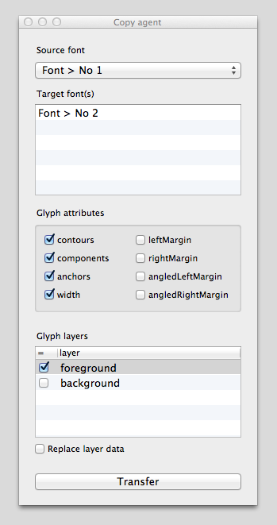

Glyph scripts
================

## build-derivatives.py

In a font’s character set, there’s a great number of glyphs that are derivatives of others. The most obvious examples are the accented glyphs made up of a letter and a mark/diacritic. These are built fairly easily with the help of anchors. But there’s also a whole other range of glyphs that are derived from other outlines and which will most of the time be built manually (or blindly via scripting).

This tool is meant to ease the extension of character sets and the deriving of glyphs that cannot be built through the anchor system. It provides a system of glyph definitions which allows you to make a new glyph by referring to one or several others, while providing a preview of the newly built glyph. The definitions include a set of transformations that can be applied per base glyph. Definitions are stored in the UFO and transferable from one font to another.

## transfer-glyphs.py

Utility to transfer glyphs from a font to another, or several others. Not all data has to come along. 

At some point, you might wonder why the script isn’t doing anything, if so, double-check that:
+ 1. you do have glyphs selected 
+ 2. you do have (a) target font(s)  selected.

NB: [replace layer data] only replaces data for checked boxes, it doesn’t clear a layer’s content. 

