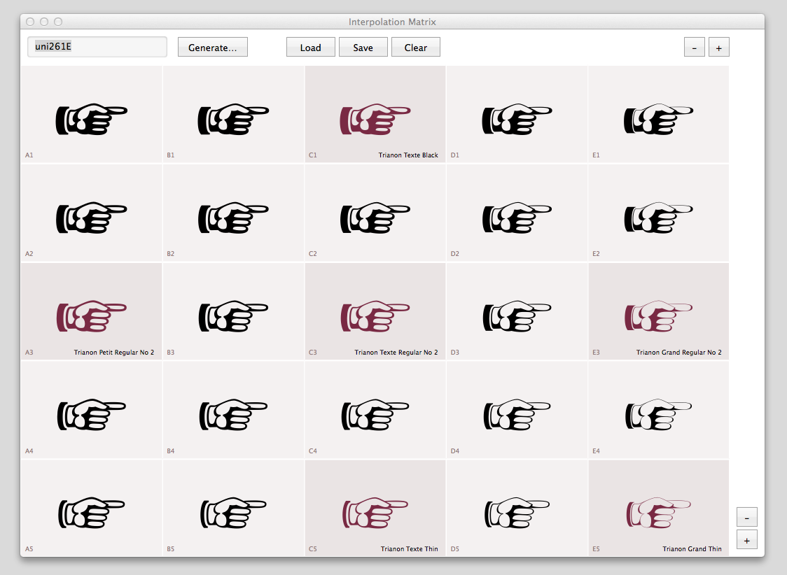
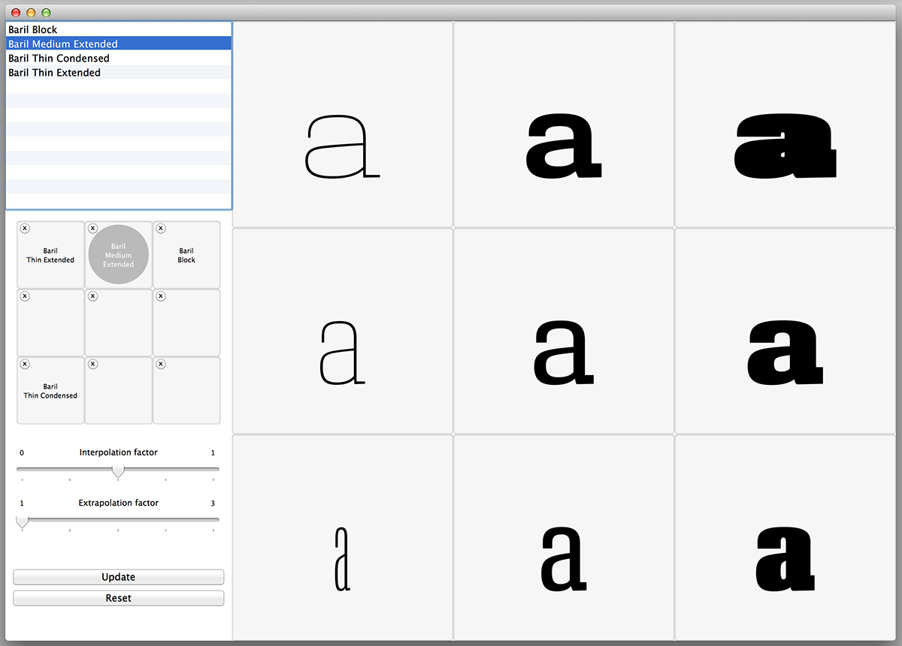

## Interpolation Matrix (MutatorMath)
================

*Note! the standalone script version of the Interpolation Matrix (.py file) will work only from ROBOFONT v1.6 onward, because it requires an installation of MutatorMath. For previous versions of Robofont, use either the extension (which has MutatorMath built-in) or the previous script [see below].*

The interpolation matrix is a tool requiring at least two master fonts open in Robofont and interpolable glyphs, if the glyphs are incompatible, no instance will show. It allows you to preview interpolation and extrapolation based on master position in an grid.

This version of the script (suffix -mutatormath) & the extension are a rewriting of the previous Interpolation Preview Matrix (see below) now using  <3, whereas previous inter/extrapolations where written by my simple self.

The glyphs are updated (almost) at draw time [mouseUp, keyUp], so you can modify glyphs and see changes happen in the matrix. Theoretically, you can have a 15x15 matrix of 225 fonts, beyond, it would get to slow to use… Testing indicates that 7x7 is the ‘maximal-optimum’ use case.

You can use the matrix to generate font instances, with font info and kerning included (or not, your choice). You choose which instance(s) to generate by naming their ‘coordinates’ (A1, B4, C3, etc.), or you can generate instances by whole rows/columns (A, 1, etc.), or all at once (*). Generated instances are issued in a folder next to the source master font (which you indicate before generating).

Last but not least, you can save matrices: grid size, window size and master fonts are stored and can be reaccessed quickly. The matrix stores a simple .txt file. It’s not ideal but does the trick for now.

Demo on Vimeo:
http://vimeo.com/109734720

## Interpolation preview matrix
================

Script requiring at least two master fonts open in Robofont and interpolable glyphs which allows you to preview interpolation and extrapolation based on master position in a 3x3 matrix.

The glyphs are updated at draw time, so you can modify glyphs and see changes happen live in the matrix (blue pill!). 
